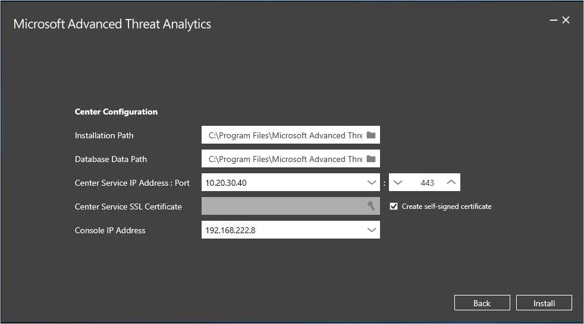

# Instalação do ATA - Etapa 1

*Aplica-se a: Advanced Threat Analytics versão 1.9*

> [!div class="step-by-step"]
> [Etapa 2 »](install-ata-step2.md)

O procedimento de instalação fornece instruções para executar uma nova instalação do ATA 1.9. Para obter mais informações sobre como atualizar uma implantação existente do ATA de uma versão anterior, veja [o guia de migração do ATA para a versão 1.9](ata-update-1.9-migration-guide.md).

> [!IMPORTANT] 
> Se você estiver usando o Windows 2012 R2, instale o KB2934520 no servidor da Central do ATA e nos servidores do Gateway do ATA antes de começar a instalação, caso contrário a instalação do ATA instalar essa atualização e exigirá uma reinicialização no meio do processo.

## Etapa 1. Baixar e instalar o Centro do ATA
Depois de verificar que o servidor atende aos requisitos, você pode prosseguir com a instalação do Centro do ATA.
    
> [!NOTE]
>Se você adquiriu uma licença para o Enterprise Mobility + Security (EMS) diretamente pelo portal Microsoft 365 ou por meio do modelo de licença do CSP(Cloud Solution Partner) e não tiver acesso ao ATA por meio do Microsoft VLSC (Volume Licensing Center), entre em contato com o atendimento ao cliente da Microsoft para obter o processo para ativar o ATA (Advanced Threat Analytics).

Execute as seguintes etapas no servidor do Centro do ATA.

1.  Baixe o ATA no [Centro de Serviços de Licenciamento por Volume da Microsoft](https://www.microsoft.com/Licensing/servicecenter/default.aspx), no [Centro de avaliação do TechNet](http://www.microsoft.com/evalcenter/) ou no [MSDN](https://msdn.microsoft.com/subscriptions/downloads).

2.  Entre no computador no qual você está instalando o Centro do ATA como um usuário que seja membro do grupo Administradores local.

3.  Execute **Microsoft ATA Center Setup.EXE** e siga o assistente de instalação.

> [!NOTE]   
> Certifique-se de executar o arquivo de instalação de uma unidade local e não de um arquivo ISO montado para evitar problemas, caso uma reinicialização seja necessária como parte da instalação.   

4. Se o Microsoft .NET Framework não estiver instalado, você precisará instalá-lo ao iniciar a instalação. Você pode ter que reinicializar após a instalação do .NET Framework.
5. Na página de **Boas-vindas**, selecione o idioma a ser usado nas telas de instalação do ATA e clique em **Avançar**.

6. Leia os Termos de Licença para Software Microsoft e, depois de aceitá-los, clique na caixa de seleção para aceitar e em **Avançar**.

7. Recomendamos configurar o ATA para atualizar automaticamente. Se a atualização automática do Windows em seu computador não estiver configurada para isso, você verá a tela **Utilizar o Microsoft Update para ajudar a manter seu computador protegido e atualizado**. 
   

8. Selecione **Usar o Microsoft Update ao verificar atualizações (recomendado)** Isso ajusta as configurações do Windows para habilitar atualizações para outros produtos da Microsoft (incluindo o ATA). 

    

9. Na página **Configure the Center (Configurar o Centro)** insira as informações a seguir com base em seu ambiente:

   |Campo|Descrição|Comentários|
   |---------|---------------|------------|
   |Caminho da Instalação|Esse é o local onde o Centro do ATA será instalado. Por padrão, é %programfiles%\Microsoft Advanced Threat Analytics\Center|Mantenha o valor padrão|
   |Caminho de Dados do Banco de Dados|Esse é o local onde os arquivos de banco de dados do MongoDB estão localizados. Por padrão, é %programfiles%\Microsoft Advanced Threat Analytics\Center\MongoDB\bin\data|Altere o local para um local onde você tem espaço para crescer com base em seu tamanho. **Observação:** <ul><li>Em ambientes de produção, você deve usar uma unidade que tenha espaço suficiente com base em um planejamento de capacidade.</li><li>Para implantações de grande porte, o banco de dados deve estar em um disco físico separado.</li></ul>Confira [Planejamento de capacidade do ATA](ata-capacity-planning.md) para obter informações sobre dimensionamento.|
   |Certificado SSL do Serviço da Central|Esse é o certificado usado pelo serviço do Centro do ATA e pelo Console do ATA.|Clique no ícone de chave para selecionar um certificado instalado ou use a caixa de seleção para criar um certificado autoassinado.|
        
   

> [!NOTE]   
> Preste atenção aos alertas de monitoramento sobre os avisos de status e de expiração do Certificado SSL do Serviço da Central. Se o certificado expirar, você precisará reimplantar completamente o ATA. 

10. Clique em **Instalar** para instalar o Centro do ATA e seus componentes.
   Os seguintes componentes serão instalados e configurados durante a instalação do Centro do ATA:

   -   Serviço da Central do ATA

   -   MongoDB

   -   Conjunto de coleta de dados do Monitor de Desempenho Personalizado

   -   Certificados autoassinados (se tiver sido selecionado durante a instalação)

11. Ao concluir a instalação, clique em **Iniciar** para abrir o Console do ATA e conclua a instalação na página **Configuração**.
   A página de configuração **Geral** abre automaticamente a fim de continuar a configuração e a implantação dos Gateways do ATA.
   Como você está fazendo logon no site usando um endereço IP, você recebe um aviso relacionado ao certificado e isso é normal. Clique em **Continuar neste site**.

### Validar a instalação

1.  Verifique se o serviço **Central do Microsoft Advanced Threat Analytics** está em execução.
2.  Na área de trabalho, clique no atalho do **Microsoft Advanced Threat Analytics** para se conectar ao Console do ATA. Faça logon com as credenciais de usuário que você usou para instalar o ATA Center.

### Definir as exclusões de antivírus

Depois de instalar o ATA Center, exclua o diretório de banco de dados do MongoDB da análise contínua realizada pelo seu aplicativo de antivírus. O local padrão no banco de dados é: **C:\Arquivos de Programas\Microsoft Advanced Threat Analytics\Center\MongoDB\bin\data**.

Exclua as pastas e os processos a seguir da verificação do AV:

**Pastas** C:\Arquivos de Programas\Microsoft Advanced Threat Analytics\Center\ParentKerberosAsBloomFilters
 C:\Arquivos de Programas\Microsoft Advanced Threat Analytics\Center\ParentKerberosTgsBloomFilters
 C:\Arquivos de Programas\Microsoft Advanced Threat Analytics\Center\Backup
 C:\Arquivos de Programas\Microsoft Advanced Threat Analytics\Center\Logs

**Processos**
 mongod.exe
 Microsoft.Tri.Center.exe

Se você instalou o ATA em um diretório diferente, não deixe de alterar os caminhos de pasta de acordo com a sua instalação. 

> [!div class="step-by-step"]
> [« Pré-instalação](configure-port-mirroring.md)
> [Etapa 2 »](install-ata-step2.md)

## Vídeos Relacionados
- [Como escolher o tipo certo de Gateway do ATA](https://channel9.msdn.com/Shows/Microsoft-Security/ATA-Deployment-Choose-the-Right-Gateway-Type)
- [Visão geral da implantação do ATA](https://channel9.msdn.com/Shows/Microsoft-Security/Overview-of-ATA-Deployment-in-10-Minutes)

## Consulte Também
- [Guia de implantação da POC (prova de conceito) do ATA](http://aka.ms/atapoc)
- [Ferramenta de dimensionamento do ATA](http://aka.ms/atasizingtool)
- [Confira o fórum do ATA!](https://social.technet.microsoft.com/Forums/security/home?forum=mata)
- [Configurar coleta de eventos](configure-event-collection.md)
- [Pré-requisitos do ATA](ata-prerequisites.md)

